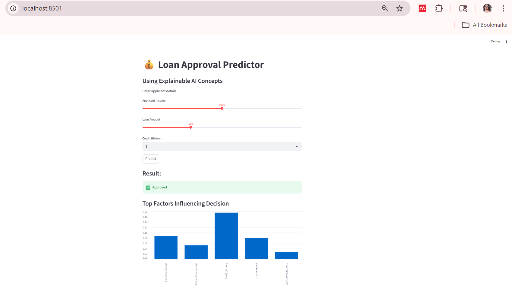

# 💰 Loan Approval Predictor (Explainable AI)


---

## 🖥️ Project Preview

 

---

## 📌 Overview

This project investigates whether Explainable AI (XAI) is necessary or overrated through a real-world case study of loan approval prediction. It combines machine learning with interpretability techniques to provide both predictions and insights into decision-making.

---

## 🚀 Features

- Predict loan approval using Machine Learning
- Interactive web interface using Streamlit
- Real-time user input handling
- Feature importance visualization (Explainable AI)
- Clean and user-friendly UI

---

## 🧠 Models Used

- **Random Forest Classifier** (Black-box model)
- **Decision Tree Classifier** (Explainable model)

---

## 🔍 How It Works

1. User enters applicant details through the web interface  
2. The trained machine learning model processes the input  
3. The system predicts loan approval status  
4. Feature importance highlights key factors influencing the decision  
5. Results are displayed interactively  

---

## ⚙️ Tech Stack

- Python  
- Pandas, NumPy  
- Scikit-learn  
- Streamlit  
- Matplotlib  
- SHAP (Explainability)

---

## 📂 Project Structure

```bash
Explainable-AI-Loan-Predictor/
│
├── app.py                     # Streamlit web application
├── gui_app.py                # Tkinter GUI version 
├── requirements.txt          # Required Python libraries
├── README.md                 # Project documentation
├── screenshot.png            # App preview image
│
└── Datasets_AI_project/
    ├── train_u6lujuX_CVtuZ9i.csv   # Training dataset
    └── test_Y3wMUE5_7gLdaTN.csv    # Testing dataset  
